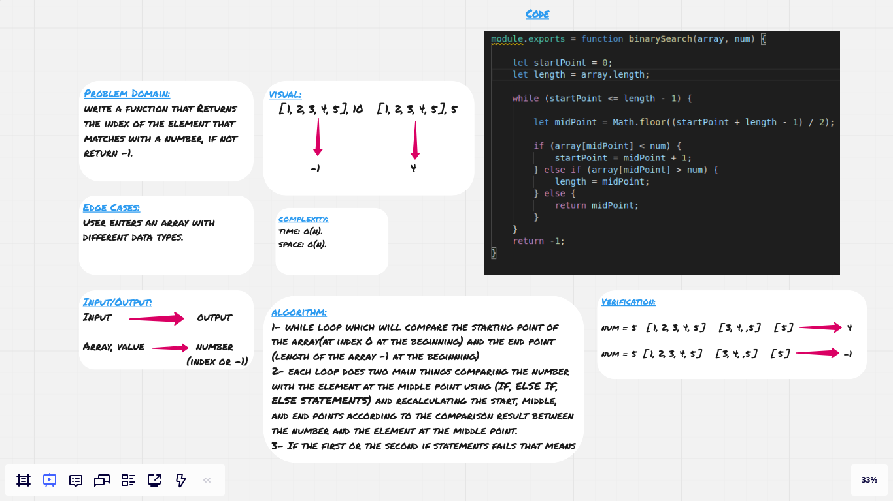

# Array Shift

There plenty of ways to insert values into an array some of them utilizes methods with built in functionality of doing that and the others are written in hard coded way.

## Challenge

Inserting value into an array without using methods with built in functionality.

## Approach & Efficiency

I used normal for loop which loops through the elements of an array and once the counter reaches half the length of the array (I used if statement to check for that) then pushes that value into the array and continues pushing the remaining elements (assuming the length is an even number), but if the length is an odd number then the length/2 will be rounded so the value will be push into the second half of the array. 

For me that was the first idea that came to my mind and it's very simple and easy to understand, also it's only a for loop with a very simple if statement to push the elements and a value into a new array, so it's not long either.

## Solution

