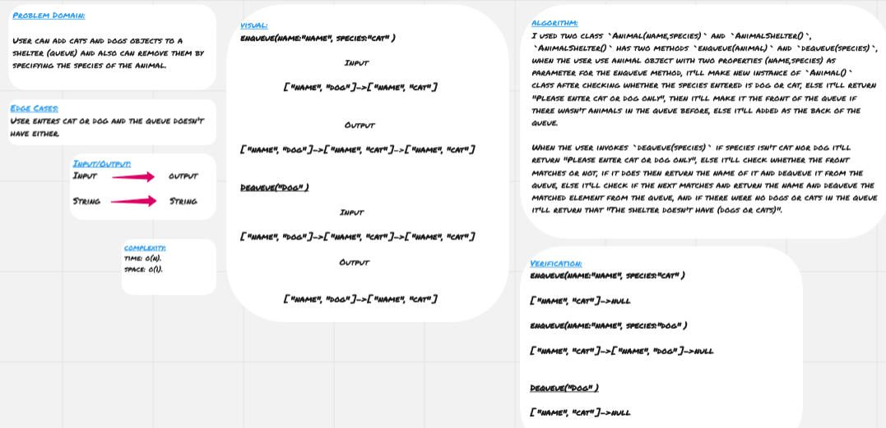

# Stack and Queue

**Stack** and **queue** are data structure that contains elements which inserted and removed according to last in first out (LIFO) when we are talking about stacks, and first in first out (FIFO) when we are talking about queues. 

<hr>

## Challenge

* User can add cats and dogs objects to a shelter (queue) and also can remove them by specifying the species of the animal.  

<hr>

## Approach & Efficiency

I used two class `Animal(name,species)` and `AnimalShelter()`, `AnimalShelter()` has two methods `enqueue(animal)` and `dequeue(species)`, when the user use animal object with two properties (name,species) as parameter for the enqueue method, it'll make new instance of `Animal()` class after checking whether the species entered is dog or cat, else it'll return "Please enter cat or dog only", then it'll make it the front of the queue if there wasn't animals in the queue before, else it'll added as the back of the queue.

When the user invokes `dequeue(species)` if species isn't cat nor dog it'll return "Please enter cat or dog only", else it'll check whether the front matches or not, if it does then return the name of it and dequeue it from the queue, else it'll check if the next matches and return the name and dequeue the matched element from the queue, and if there were no dogs or cats in the queue it'll return that "The shelter doesn't have (dogs or cats)".
 
### Big O

**Space:** O(1)
**Time:** O(n)

<hr>

## Solution




### Code

```
'use strict';

class Animal {
    constructor(name, species) {
        this.nameAndSpecies = { name, species };
        this.next = null;
    }
}

class AnimalShelter {
    constructor() {
        this.front = null;
        this.back = null;
    }

    enqueue(animal) {
        if (animal.species.toLowerCase() === 'dog' || animal.species.toLowerCase() === 'cat') {
            let newAnimal = new Animal(animal.name, animal.species.toLowerCase());
            if (!this.front) {
                this.front = newAnimal;
                this.back = newAnimal;
            } else {
                this.back.next = newAnimal;
                this.back = newAnimal
            }
        } else {
            return 'Please enter cat or dog only';
        }
    }

    dequeue(species) {
        if (species.toLowerCase() === 'dog' || species.toLowerCase() === 'cat') {
            if (this.front.nameAndSpecies.species === species.toLowerCase()) {
                let oldFront = this.front;
                this.front = this.front.next;
                oldFront.next = null;
                return oldFront.nameAndSpecies.name;
            }

            let current = this.front;
            while (current.next) {
                if (current.next.nameAndSpecies.species === species.toLowerCase()) {
                    let dequeuedAnimal = current.next;
                    current.next = current.next.next;
                    dequeuedAnimal.next = null;
                    return dequeuedAnimal.nameAndSpecies.name;
                }
                current = current.next;
            }
            return `The shelter doesn't have ${species}s`;
        }
        return `${species} isn't cat nor dog`;
    }
}

module.exports = AnimalShelter;
```

#### Tests Code

```
'use strict';

const AnimalShelter = require('../fifo-animal-shelter.js');

describe('=======================ANIMAL SHELTER=======================', () => {
    it('Should add new animal to the shelter if it only was cat or dog', () => {
        let animal1 = { name: 'test', species: 'dog' };
        let animal2 = { name: 'test2', species: 'cat' };
        let animal3 = { name: 'test', species: 'human' };

        let shelter = new AnimalShelter();

        shelter.enqueue(animal1);
        shelter.enqueue(animal2);
        // console.log(shelter);
        expect(shelter.front.nameAndSpecies.name).toEqual(animal1.name);
        expect(shelter.front.next.nameAndSpecies.name).toEqual(animal2.name);
        expect(shelter.enqueue(animal3)).toEqual('Please enter cat or dog only');
    });
it('Should return dog or cat (according to the input) from the shelter', () => {
        let animal1 = { name: 'test', species: 'cat' };
        let animal2 = { name: 'test2', species: 'cat' };
        let animal3 = { name: 'test3', species: 'dog' };
        let animal4 = { name: 'test4', species: 'cat' };
        let randomSpecies = 'human';
        let shelter = new AnimalShelter();

        shelter.enqueue(animal1);
        shelter.enqueue(animal2);
        shelter.enqueue(animal3);
        shelter.enqueue(animal4);

        expect(shelter.dequeue(randomSpecies)).toEqual(`${randomSpecies} isn't cat nor dog`);
        expect(shelter.dequeue('cat')).toEqual(animal1.name);
        expect(shelter.dequeue('dog')).toEqual(animal3.name);
        expect(shelter.dequeue('dog')).toEqual(`The shelter doesn't have dogs`);
    });
});
```