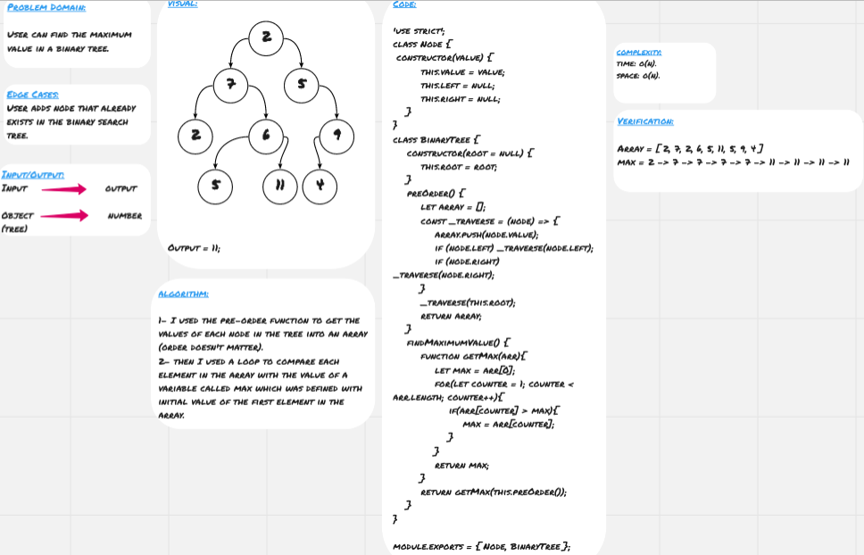

# Tree 

**Tree** is non-linear data structure which is basically collection of nodes linked together to simulate a hierarchy, each node refers to its children nodes. The node at the top is called root, the nodes which have the same parent are called siblings, the nodes which don't have children are called leaves.

## Challenge

* User can find the maximum value in a binary tree.

## Approach & Efficiency

* I used the pre-order function to get the values of each node in the tree into an array (order doesn't matter).
* then I used a loop to compare each element in the array with the value of a variable called max which was defined with initial value of the first element in the array. 
 
### Big O

**Space:** O(n)
**Time:** O(h)

## Solution

