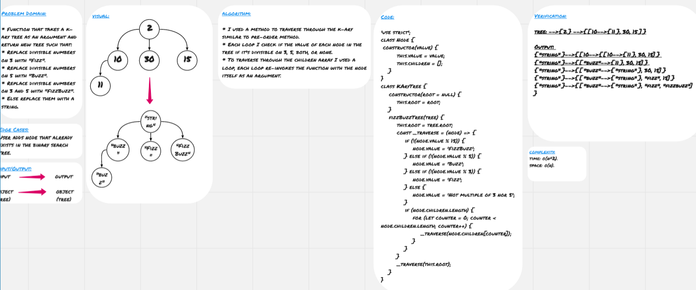

# Tree 

**Tree** is non-linear data structure which is basically collection of nodes linked together to simulate a hierarchy, each node refers to its children nodes. The node at the top is called root, the nodes which have the same parent are called siblings, the nodes which don't have children are called leaves.

## Challenge

* Function that takes a k-ary tree as an argument and return new tree such that: 
* Replace divisible numbers on 3 with "Fizz".
* Replace divisible numbers on 5 with "Buzz".
* Replace divisible numbers on 3 and 5 with "FizzBuzz".
* Else replace them with a string.

## Approach & Efficiency

* I used a method to traverse through the k-ary similar to pre-order method.
* Each loop I check if the value of each node in the tree if it's divisible on 3, 5, both, or none.
* To traverse through the children array I used a loop, each loop re-invokes the function with the node itself as an argument.

### Big O

**Space:** O(n)
**Time:** O(n^2)

## Solution

