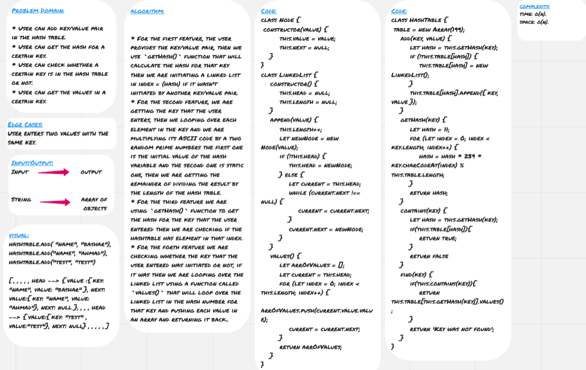

# Hash Tables

**Hash tables** are another way to store data in the memory, they are similar to arrays but they are much more efficient.

**Hash tables** are similar to arrays where you can store key/value pair in each index, but to search for a certain value you will only need the key with time complexity of O(1), this can be possible by signing each value in an index equal to a number called *hash* that's calculated with different algorithms and the more efficient this algorithm to calculate the hash for each key, the more that hash tree will be.

Assuming there were two values with the same key, simply we use linked lists to assign values in each index.

## Challenge

* User can add key/value pair in the hash table.
* User can get the hash for a certain key.
* User can check whether a certain key is in the hash table or not.
* User can get the values in a certain key.

## Approach & Efficiency

* For the first feature, the user provides the key/value pair, then we use `getHash()` function that will calculate the hash for that key then we are initiating a linked list in index = (hash) if it wasn't initiated by another key/value pair.
* For the second feature, we are getting the key that the user enters, then we looping over each element in the key and we are multiplying its ASCII code by a two random prime numbers the first one is the initial value of the hash variable and the second one is static one, then we are getting the remainder of dividing the result by the length of the hash table.
* For the third feature we are using `getHash()` function to get the hash for the key that the user entered then we are checking if the hashtable has element in that index.
* For the forth feature we are checking whether the key that the user entered was initiated or not, if it was then we are looping over the linked list using a function called `values()` that will loop over the linked list in the hash number for that key and pushing each value in an array and returning it back.

### Big O

**Space:** O(n)
**Time:** O(n)

## Solution

