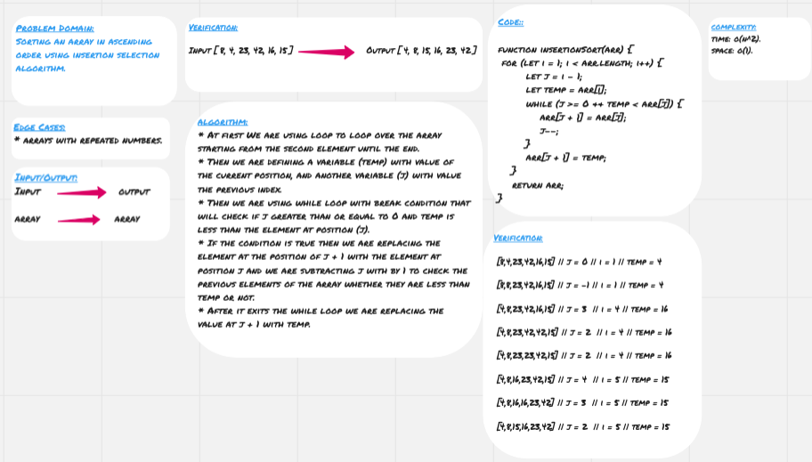

# Insertion Sort

* **Insertion sort** algorithm is similar to sorting playing cards from while you are holding them in a hand and moving them to the other hand but in a sorted manner, but instead of using both hands we can use only one hand. In coding we are dividing the array into two sections; sorted and unsorted, and we are assuming at the beginning is that the first element is sort, so it's in the sorted section and the rest are in the unsorted section.

## Challenge

* Sorting an array in ascending order using insertion selection algorithm.

## Approach & Efficiency

* At first We are using loop to loop over the array starting from the second element until the end.
* Then we are defining a variable (temp) with value of the current position, and another variable (j) with value the previous index.
* Then we are using while loop with break condition that will check if j greater than or equal to 0 and temp is less than the element at position (j).
* If the condition is true then we are replacing the element at the position of j + 1 with the element at position j and we are subtracting j with by 1 to check the previous elements of the array whether they are less than temp or not.
* After it exits the while loop we are replacing the value at j + 1 with temp. 

### Big O

**Space:** O(1)
**Time:** O(n^2)

## Solution

