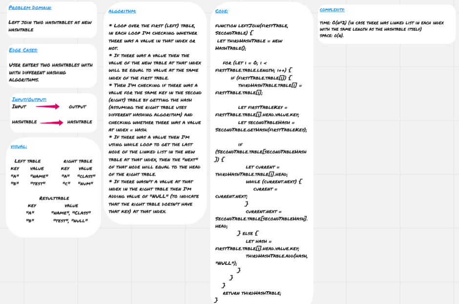

# Left Join

**Left Join** means all the values in the first (left) hashtable are returned, and if values exist in the “right” hashtable, they are appended to the result row.

## Challenge

Left join two hashtables as new hashtable

## Approach & Efficiency

* Loop over the first (left) table, in each loop I'm checking whether there was a value in that index or not.
* If there was a value then the value of the new table at that index will be equal to value at the same index of the first table.
* Then I'm checking if there was a value for the same key in the second (right) table by getting the hash (assuming the right table uses different hashing algorithm) and checking whether there was a value at index = hash.
* If there was a value then I'm using while loop to get the last node of the linked list in the new table at that index, then the "next" of that node will equal to the head of the right table.
* If there wasn't a value at that index in the right table then I'm adding value of "NULL" (to indicate that the right table doesn't have that key) at that index.

### Big O

**Space:** O(n)
**Time:** O(n^2) (in case there was linked list in each index with the same length as the hashtable itself)

## Solution

