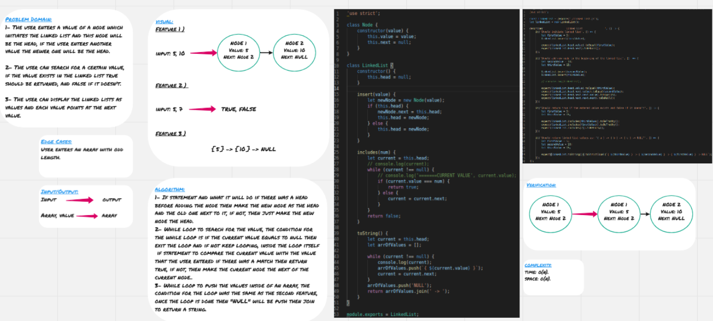

# Linked List

**Linked Lists** are another way to store data in the memory, they are similar to arrays but they are much more efficient.

**Linked Lists** basically are objects(**Nodes**) inside of other objects, each **Node** has to properties; value and next, next points at the next node.

There are three main parameters in linked lists, head (the node at the beginning of the linked list), current(the node at which the pointer is pointing), next (the node next of the current node).

## Challenge

The user enters a value of a node which initiates the linked list and this node will be the head, if the user enters another value the newer one will be the head.

The user can search for a certain value, if the value exists in the linked list true should be returned, and false if it doesn't.

The user can display the linked lists as values and each value points at the next value.

## Approach & Efficiency

For the first feature, I used if statement and what it will do if there was a head before adding the node then make the new node as the head and the old one next to it, if not, then just make the new node the head.

For the second feature, I used while loop to search for the value, the condition for the while loop is if the current value equals to null then exit the loop and if not keep looping, inside the loop itself I used if statement to compare the current value with the value that the user entered if there was a match then return true, if not, then make the current node the next of the current node.

For the last feature, I used while loop to push the values inside of an array, the condition for the loop was the same as the second feature, once the loop is done then "NULL" will be push and I used join to return a string.

### Big O

**Space:** O(n) since I used array and objects.\
**Time:** O(n) since I used two while loops.

## Solution

