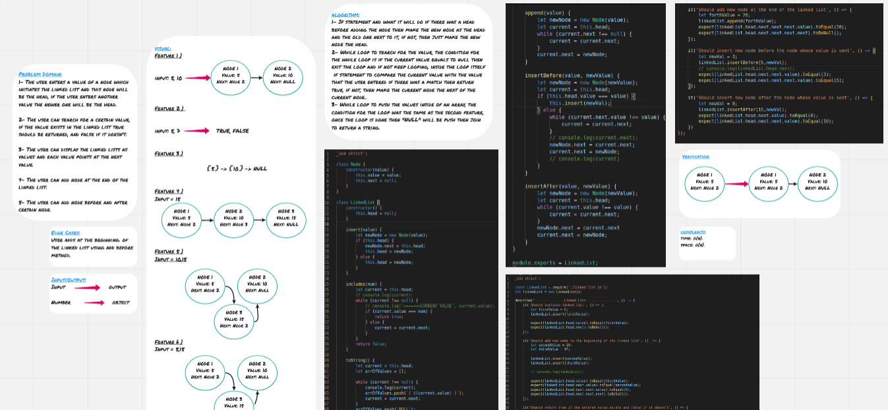
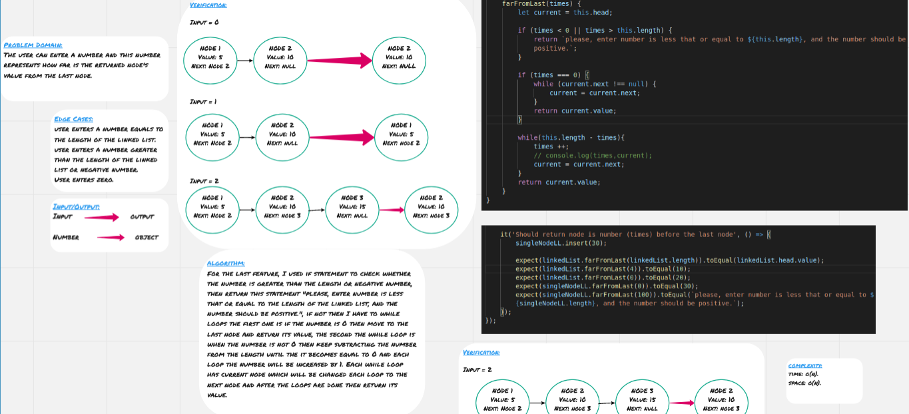

# Linked List

**Linked Lists** are another way to store data in the memory, they are similar to arrays but they are much more efficient.

**Linked Lists** basically are objects(**Nodes**) inside of other objects, each **Node** has to properties; value and next, next points at the next node.

There are three main parameters in linked lists, head (the node at the beginning of the linked list), current(the node at which the pointer is pointing), next (the node next of the current node).

## Challenge

The user enters a value of a node which initiates the linked list and this node will be the head, if the user enters another value the newer one will be the head.

The user can search for a certain value, if the value exists in the linked list true should be returned, and false if it doesn't.

The user can display the linked lists as values and each value points at the next value.

The user can add values at the end of the linked list, before certain node, and after certain node by giving the value of these nodes.

The user can enter a number and this number represents how far is the returned node's value from the last node.

## Approach & Efficiency

For the first feature, I used if statement and what it will do if there was a head before adding the node then make the new node as the head and the old one next to it, if not, then just make the new node the head.

For the second feature, I used while loop to search for the value, the condition for the while loop is if the current value equals to null then exit the loop and if not keep looping, inside the loop itself I used if statement to compare the current value with the value that the user entered if there was a match then return true, if not, then make the current node the next of the current node.

For the third feature, I used while loop to push the values inside of an array, the condition for the loop was the same as the second feature, once the loop is done then "NULL" will be push and I used join to return a string.

For the forth feature, I used while loop and the condition if the next value to the current node in null, then add the new node and make the next to the last old node the new node.

For the fifth feature, I used if statement to check whether the entered value equals to the value of the header then call feature #1, else I used while loop and the condition if the value of the next to the current node is equal to the entered value by the user, then make the next to new node equals the next to the current node and make the next to the current node is the new node.

For the sixth feature, I used the same while loop as feature five but the condition for the while loop is comparing the current node value to value that the user entered and the rest is the same as the fifth feature.

For the last feature, I used if statement to check whether the number is greater than the length or negative number, then return this statement "please, enter number is less that or equal to the length of the linked list, and the number should be positive.", if not then I have to while loops the first one is if the number is 0 then move to the last node and return its value, the second the while loop is when the number is not 0 then keep subtracting the number from the length until the it becomes equal to 0 and each loop the number will be increased by 1. Each while loop has current node which will be changed each loop to the next node and after the loops are done then return its value.

### Big O

**Space:** O(n) 
**Time:** O(n) 

## Solution

### Whiteboard for the first six features

### Whiteboard for the last feature

