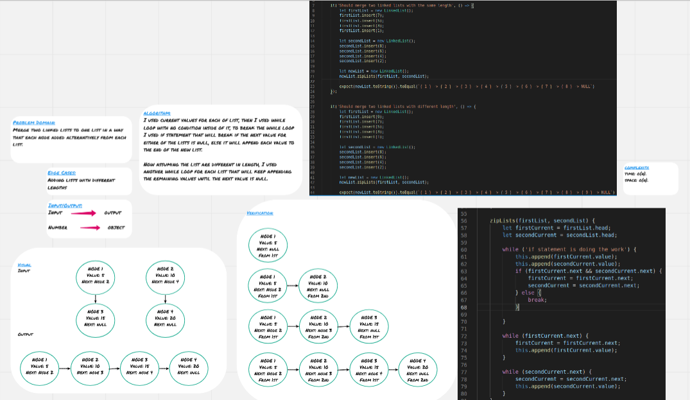

# Linked List

**Linked Lists** are another way to store data in the memory, they are similar to arrays but they are much more efficient.

**Linked Lists** basically are objects(**Nodes**) inside of other objects, each **Node** has to properties; value and next, next points at the next node.

There are three main parameters in linked lists, head (the node at the beginning of the linked list), current(the node at which the pointer is pointing), next (the node next of the current node).

## Challenge

Merge two linked lists to one list in a way that each node added alternatively from each list.

## Approach & Efficiency

I used current values for each of list, then I used while loop with no condition inside of it, to break the while loop I used if statement that will break if the next value for either of the lists is null, else it will append each value to the end of the new list.

Now assuming the list are different in length, I used another while loop for each list that will keep appending the remaining values until the next value is null.

### Big O

**Space:** O(n) 
**Time:** O(n) 

## Solution

### Whiteboard for the first six features

