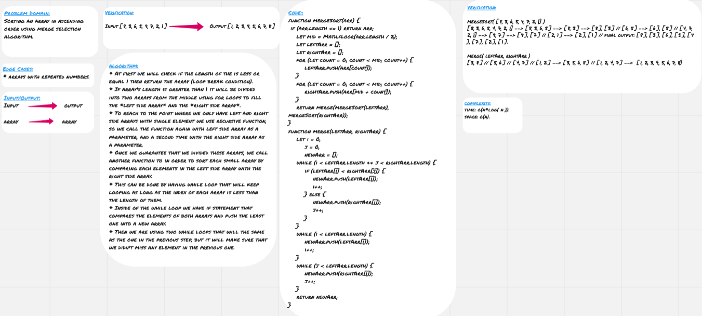

# Tree

* **Merge Sort** algorithm is basically dividing the array into multiple arrays with single element, then sorting these small arrays by comparing each one to the next array, each iteration the resultant array will be sorted two times longer than the previous one (it will be a combination of the two previous "small" arrays).  

## Challenge

* Sorting an array in ascending order using merge selection algorithm.

## Approach & Efficiency

* At first we will check if the length of the is less or equal 1 then return the array (loop break condition).
* If array's length is greater than 1 it will be divided into two arrays from the middle using for loops to fill the *left side array* and the *right side array*.
* To reach to the point where we only have left and right side arrays with single element we use recursive function, so we call the function again with left side array as a parameter, and a second time with the right side array as a parameter.
* Once we guarantee that we divided these arrays, we call another function to in order to sort each small array by comparing each elements in the left side array with the right side array.
* This can be done by having while loop that will keep looping as long as the index of each array is less than the length of them.
* Inside of the while loop we have if statement that compares the elements of both arrays and push the least one into a new array.
* Then we are using two while loops that will the same as the one in the previous step, but it will make sure that we didn't miss any element in the previous one.

### Big O

**Space:** O(n)
**Time:** O(nlog(n))

## Solution

