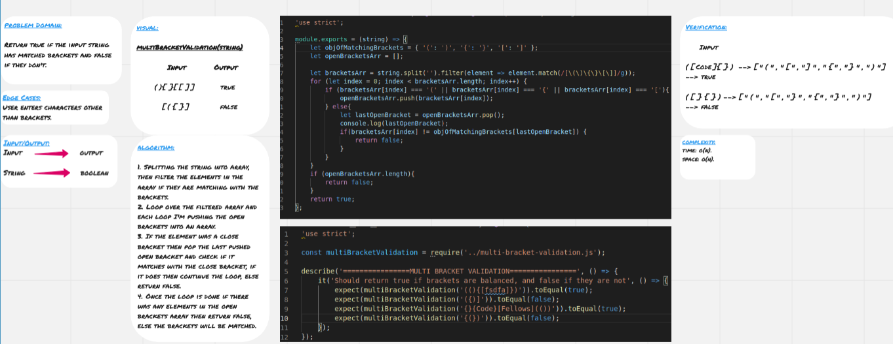

# Multi Bracket Validation

Multi bracket validation is a very important feature for error detection, we all have through forgetting to close brackets, so this feature comes to rescue.

## Challenge

Return true if the input string has matched brackets and false if they don't.

## Approach & Efficiency

1. Splitting the string into array, then filter the elements in the array if they are matching with the brackets.
2. Loop over the filtered array and each loop I'm pushing the open brackets into an array.
3. If the element was a close bracket then pop the last pushed open bracket and check if it matches with the close bracket, if it does then continue the loop, else return false.
4. Once the loop is done if there was any elements in the open brackets array then return false, else the brackets will be matched.

 
### Big O

**Space:** O(n)
**Time:** O(n)

## Solution

