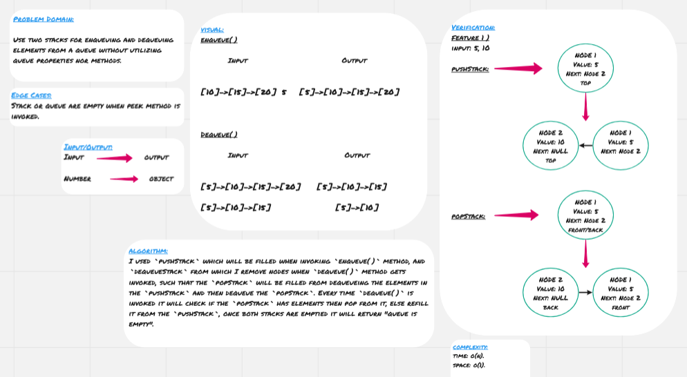

# Stack and Queue

**Stack** and **queue** are data structure that contains elements which inserted and removed according to last in first out (LIFO) when we are talking about stacks, and first in first out (FIFO) when we are talking about queues. 

<hr>

## Challenge

* Use two stacks for enqueueing and dequeueing elements from a queue without utilizing queue properties nor methods.

<hr>

## Approach & Efficiency

I used `pushStack` which will be filled when invoking `enqueue()` method, and `dequeueStack` from which I remove nodes when `dequeue()` method gets invoked, such that the `popStack` will be filled from dequeueing the elements in the `pushStack` and then dequeue the `popStack`. Every time `dequeue()` is invoked it will check if the `popStack` has elements then pop from it, else refill it from the `pushStack`, once both stacks are emptied it will return "queue is empty".
 
### Big O

**Space:** O(1)
**Time:** O(n)

<hr>

## Solution




### Code

```
'use strict';

class Node {
    constructor(value) {
        this.value = value;
        this.next = null
    }
}

class Stack {
    constructor() {
        this.top = null;
    }

    push(value) {
        let newNode = new Node(value);
        if (this.top) {
            newNode.next = this.top;
        }
        this.top = newNode;
    }

    pop() {
        if (this.top) {
            let poppedNode = this.top;
            this.top = poppedNode.next;
            poppedNode.next = null;
            return poppedNode;
        }
        return 'Stack is empty';
    }

    peek() {
        if (this.top) {
            return this.top;
        }
        return 'Stack is empty';
    }
}

class PseudoQueue {
    constructor() {
        this.pushStack = new Stack();
        this.popStack = new Stack();
    }

    enqueue(value) {
        this.pushStack.push(value);
    }

    dequeue() {
        if (this.popStack.top || this.pushStack.top) {
            if (!this.popStack.top) {
                while (this.pushStack.top) {
                    this.popStack.push(this.pushStack.pop().value);
                }
            }
            return this.popStack.pop();
        }
        return 'Queue is empty';
    }
}

module.exports = PseudoQueue;
```

#### Tests Code

```
'use strict';

const PseudoQueue = require('../queue-with-stacks.js');

describe('==================PSEUDO QUEUE==================', () => {
    it('Should initiate pushStack', () => {
        let queue = new PseudoQueue();
        let firstValue = 5;
        let secondValue = 10;
        let thirdValue = 15;

        queue.enqueue(firstValue);
        queue.enqueue(secondValue);
        queue.enqueue(thirdValue);

        expect(queue.pushStack.top.value).toEqual(thirdValue);
        expect(queue.pushStack.top.next.next.value).toEqual(firstValue);
    });

    it('Should dequeue the front node from the queue', () => {
        let queue = new PseudoQueue();
        let firstValue = 5;
        let secondValue = 10;
        let thirdValue = 15;

        queue.enqueue(firstValue);
        queue.enqueue(secondValue);
        queue.enqueue(thirdValue);

        expect(queue.dequeue().value).toEqual(firstValue);
        expect(queue.dequeue().value).toEqual(secondValue);
        expect(queue.dequeue().value).toEqual(thirdValue);
        expect(queue.dequeue()).toEqual('Queue is empty');
    });
});
```