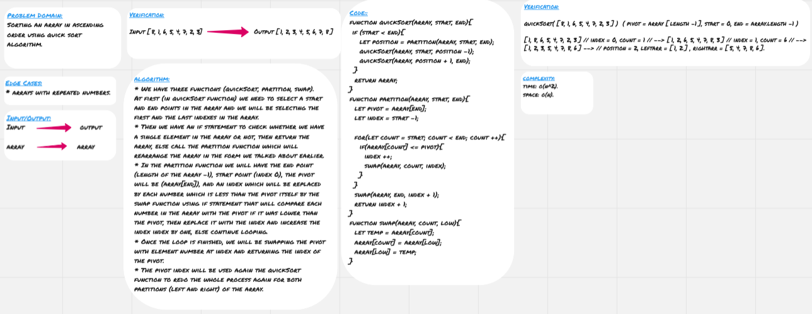

# Quick Sort

* **Quick sort** algorithm is a random element (pivot) in an array and putting all the element less than the pivot on the left of it and the greater elements on the right of it.
* Then redo the same process for the left and the right parts of the array until we reach to one element in the each part of the array.

## Challenge

* Sorting an array in ascending order using quick sort algorithm.

## Approach & Efficiency

* We have three functions (`quickSort`, `partition`, `swap`).
* At first (in `quickSort` function) we need to select a `start` and `end` points in the array and we will be selecting the first and the last indexes in the array.
* Then we have an if statement to check whether we have a single element in the array or not, then return the array, else call the `partition` function which will rearrange the array in the form we talked about earlier.
* In the `partition` function we will have the `end` point (length of the array -1), `start` point (index 0), the `pivot` will be (`array[end]`), and an `index` which will be replaced by each number which is less than the `pivot` itself by the `swap` function using if statement that will compare each number in the array with the `pivot` if it was lower than the `pivot`, then replace it with the `index` and increase the `index` index by one, else continue looping.
* Once the loop is finished, we will be swapping the `pivot` with element number at `index` and returning the index of the `pivot`.
* The pivot index will be used again the `quickSort` function to redo the whole process again for both partitions (left and right) of the array.

### Big O

**Space:** O(n)
**Time:** O(n^2)

## Solution

