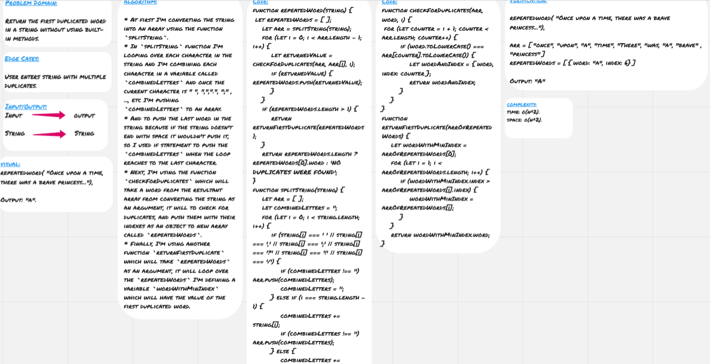

# Repeated Word

This function will detect the repeated words and will return the first duplicate.

## Challenge

Return the first duplicated word in a string without using built-in methods.

## Approach and Efficiency

* At first I'm converting the string into an array using the function `splitString`.
* In `splitString` function I'm looping over each character in the string and I'm combining each character in a variable called `combinedLetters` and once the current character is " ", ",",".", ";" , ..., etc I'm pushing `combinedLetters` to an array.
* And to push the last word in the string because if the string doesn't end with space it wouldn't push it, so I used if statement to push the `combinedLetters` when the loop reaches to the last character.
* Next, I'm using the function `checkForDuplicates` which will take a word from the resultant array from converting the string as an argument, it will to check for duplicates, and push them with their indexes as an object to new array called `repeatedWords`.
* Finally, I'm using another function `returnFirstDuplicate` which will take `repeatedWords` as an argument, it will loop over the `repeatedWords` I'm defining a variable `wordWithMinIndex` which will have the value of the first duplicated word.

### Big O

**Space:** O(n^2)
**Time:** O(n^2)

## Solution

