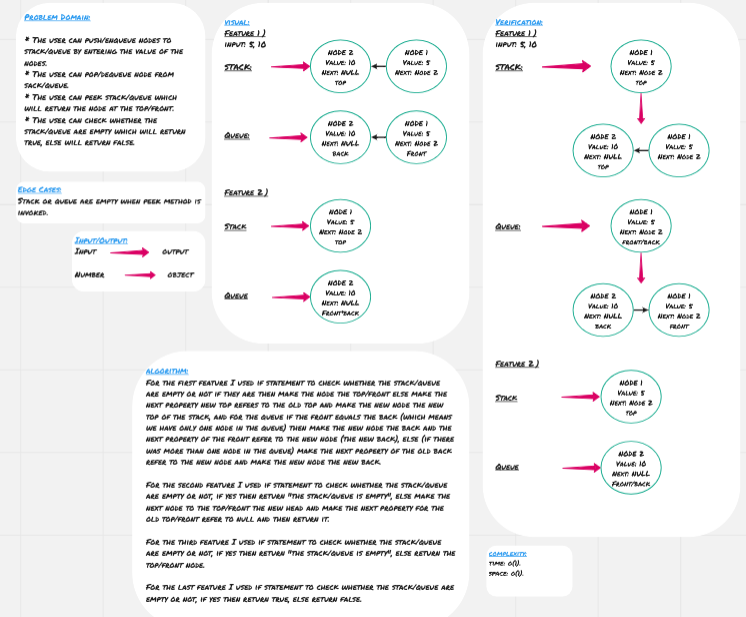

# Stack and Queue

**Stack** and **queue** are data structure that contains elements which inserted and removed according to last in first out (LIFO) when we are talking about stacks, and first in first out (FIFO) when we are talking about queues. 

<hr>

## Challenge

* The user can push/enqueue nodes to stack/queue by entering the value of the nodes.
* The user can pop/dequeue node from sack/queue.
* The user can peek stack/queue which will return the node at the top/front.
* The user can check whether the stack/queue are empty which will return true, else will return false.

<hr>

## Approach & Efficiency

For the first feature I used if statement to check whether the stack/queue are empty or not if they are then make the node the top/front else make the next property new top refers to the old top and make the new node the new top of the stack, and for the queue if the front equals the back (which means we have only one node in the queue) then make the new node the back and the next property of the front refer to the new node (the new back), else (if there was more than one node in the queue) make the next property of the old back refer to the new node and make the new node the new back.

For the second feature I used if statement to check whether the stack/queue are empty or not, if yes then return "the stack/queue is empty", else make the next node to the top/front the new head and make the next property for the old top/front refer to null and then return it.

For the third feature I used if statement to check whether the stack/queue are empty or not, if yes then return "the stack/queue is empty", else return the top/front node.

For the last feature I used if statement to check whether the stack/queue are empty or not, if yes then return true, else return false.
 
### Big O

**Space:** O(1)
**Time:** O(1)

<hr>

## Solution




### Code

```
'use strict';

class Node {
    constructor(value) {
        this.value = value;
        this.next = null
    }
}

class Stack {
    constructor() {
        this.top = null;
    }

    push(value) {
        let newNode = new Node(value);
        if (this.top) {
            newNode.next = this.top;
        }
        this.top = newNode;
    }

    pop() {
        if (this.top) {
            let poppedNode = this.top;
            this.top = poppedNode.next;
            poppedNode.next = null;
            return poppedNode;
        }
        return 'Stack is empty';
    }

    peek() {
        if (this.top) {
            return this.top;
        }
        return 'Stack is empty';
    }

    isEmpty() {
        if (this.top) {
            return false;
        }
        return true
    }
}

class Queue {
    constructor() {
        this.front = null;
        this.back = null;
    }

    enqueue(value) {
        let newNode = new Node(value);
        if (this.front) {
            if (this.front === this.back) {
                this.front.next = newNode;
                this.back = newNode;
            } else {
                this.back.next = newNode;
                this.back = newNode;
            }
        } else {
            this.front = newNode;
            this.back = this.front;
        }
    }

    dequeue() {
        if (this.front && this.front.next) {
            let oldFront = this.front;
            this.front = this.front.next;
            oldFront.next = null;
            return oldFront;
        }

        if (this.front) {
            let oldFront = this.front;
            this.front = null;
            return oldFront;
        }

        return 'Queue is empty';
    }

    peek() {
        if (this.front) {
            return this.front;
        }

        return 'Queue is empty';
    }

    isEmpty() {
        if (this.front) {
            return false;
        }
        
        return true;
    }

}


module.exports = { Stack, Queue };
```

### Tests Code

```
'use strict';

const Stack = require('../stacks-and-queues.js').Stack;
const Queue = require('../stacks-and-queues.js').Queue;

describe('==================STACK==================', () => {
    it('Should push new node to the stack', () => {
        let stack = new Stack()
        let firstValue = 5;
        let secondValue = 10;

        stack.push(firstValue);
        stack.push(secondValue);

        expect(stack.top.value).toEqual(secondValue);
        expect(stack.top.next.value).toEqual(firstValue);
        expect(stack.top.next.next).toBeNull();
    });

    it('Should pop node from the stack', () => {
        let stack = new Stack();
        let emptyStack = new Stack();
        let firstValue = 5;
        let secondValue = 10;
        stack.push(firstValue);
        stack.push(secondValue);

        let returnedValue = stack.pop();

        expect(stack.top.value).toEqual(firstValue);
        expect(returnedValue.value).toEqual(secondValue);
        expect(stack.top.next).toBeNull();
        expect(emptyStack.pop()).toEqual('Stack is empty');
    });

    it('Should return the node at the top of the stack', () => {
        let stack = new Stack();
        let emptyStack = new Stack();
        let firstValue = 5;
        let secondValue = 10;
        stack.push(firstValue);
        stack.push(secondValue);

        
        expect(stack.peek()).toEqual(stack.top);
        expect(emptyStack.peek()).toEqual('Stack is empty');
    });

    it('Should return true if the stack is empty and false if it is not', () => {
        let stack = new Stack();
        let emptyStack = new Stack();
        let firstValue = 5;
        
        stack.push(firstValue);
        
        expect(stack.isEmpty()).toBeFalsy();
        expect(emptyStack.isEmpty()).toBeTruthy();
    });
});

describe('==================QUEUE==================', () => {
    it('Should enqueue new node to the queue', () => {
        let queue = new Queue();
        let queueWithSingleNode = new Queue();
        let firstValue = 5;
        let secondValue = 10;
        let thirdValue = 15;

        queue.enqueue(firstValue);
        queue.enqueue(secondValue);
        queue.enqueue(thirdValue);
        queueWithSingleNode.enqueue(firstValue);

        expect(queue.front.value).toEqual(firstValue);
        expect(queue.front.next.value).toEqual(secondValue);
        expect(queue.back.value).toEqual(thirdValue);
        expect(queue.back.next).toBeNull();
        expect(queueWithSingleNode.front).toEqual(queueWithSingleNode.back);
    });

    it('Should dequeue node from the queue', () => {
        let queue = new Queue();
        let emptyQueue = new Queue();
        let firstValue = 5;
        let secondValue = 10; 
        queue.enqueue(firstValue);
        queue.enqueue(secondValue);
        let returnedValue = queue.dequeue();
        
        expect(returnedValue.value).toEqual(firstValue);
        expect(queue.front.value).toEqual(secondValue);
        expect(emptyQueue.dequeue()).toEqual('Queue is empty');
    });

    it('Should return the node at the front of the queue', () => {
        let queue = new Queue();
        let emptyQueue = new Queue();
        let firstValue = 5;
        let secondValue = 10; 
        queue.enqueue(firstValue);
        queue.enqueue(secondValue);

        expect(queue.peek()).toEqual(queue.front);
        expect(emptyQueue.peek()).toEqual('Queue is empty');
    });

    it('Should return true if the queue is empty and false if it is not', () => {
        let queue = new Queue();
        let emptyQueue = new Queue();
        let firstValue = 5;
        queue.enqueue(firstValue);

        expect(queue.isEmpty()).toBeFalsy();
        expect(emptyQueue.isEmpty()).toBeTruthy();
    });
});
```