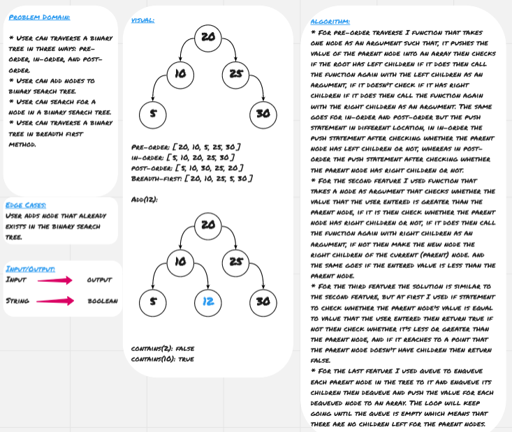
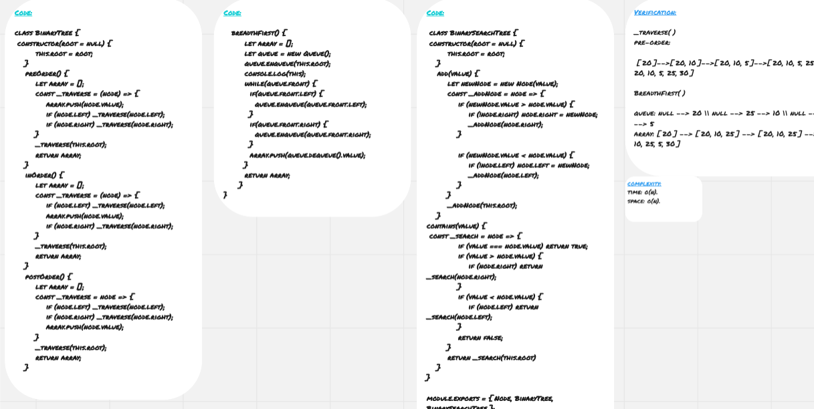

# Tree 

**Tree** is non-linear data structure which is basically collection of nodes linked together to simulate a hierarchy, each node refers to its children nodes. The node at the top is called root, the nodes which have the same parent are called siblings, the nodes which don't have children are called leaves.

## Challenge

* User can traverse a binary tree in three ways: pre-order, in-order, and post-order.
* User can add nodes to binary search tree.
* User can search for a node in a binary search tree.
* User can traverse a binary tree in breadth first method.

## Approach & Efficiency

* For pre-order traverse I used function that takes one node as an argument such that, it pushes the value of the parent node into an array then checks if the root has left children if it does then call the function again with the left children as an argument, if it doesn't check if it has right children if it does then call the function again with the right children as an argument. The same goes for in-order and post-order but the push statement in different location, in in-order the push statement after checking whether the parent node has left children or not, whereas in post-order the push statement after checking whether the parent node has right children or not.

* For the seconde feature I used function that takes a node as argument that checks whether the value that the user entered is greater than the parent node, if it is then check whether the parent node has right children or not, if it does then call the function again with right children as an argument, if not then make the new node the right children of the current (parent) node. and the same goes if the entered value is less than the parent node.

* For the third feature the solution is similar to the second feature, but at first I used if statement to check whether the parent node's value is equal to value that the user entered then return true if not then check whether it's less or greater than the parent node, and if it reaches to a point that the parent node doesn't have children then return false.

* For the last feature I used queue to enqueue each parent node in the tree to it and enqueue its children then dequeue and push the value for each dequeued node to an array. The loop will keep going until the queue is empty which means that there are no children left for the parent nodes.
 
### Big O

**Space:** O(n)
**Time:** O(h)

## Solution

