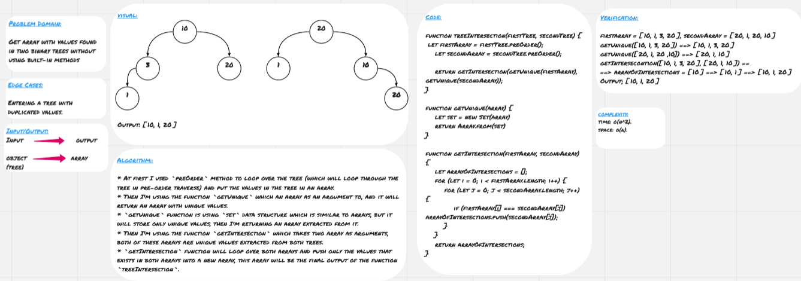

# Tree Intersection

**Tree** is non-linear data structure which is basically collection of nodes linked together to simulate a hierarchy, each node refers to its children nodes. The node at the top is called root, the nodes which have the same parent are called siblings, the nodes which don't have children are called leaves.

## Challenge

* Get array with values found in two binary trees without using built-in methods.

## Approach & Efficiency

* At first I used `preOrder` method to loop over the tree (which will loop through the tree in pre-order traverse) and put the values in the tree in an array.
* Then I'm using the function `getUnique` which an array as an argument to, and it will return an array with unique values.
* `getUnique` function is using `set` data structure which is similar to arrays, but it will store only unique values, then I'm returning an array extracted from it.
* Then I'm using the function `getIntersection` which takes two array as arguments, both of these arrays are unique values extracted from both trees.
* `getIntersection` function will loop over both arrays and push only the values that exists in both arrays into a new array, this array will be the final output of the function `treeIntersection`.

### Big O

**Space:** O(n)
**Time:** O(n^2)

## Solution

